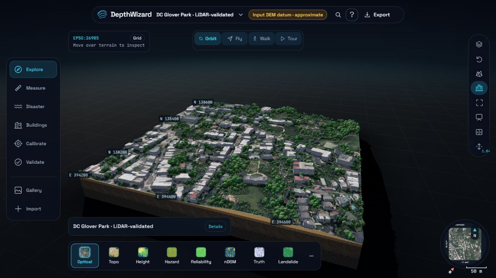
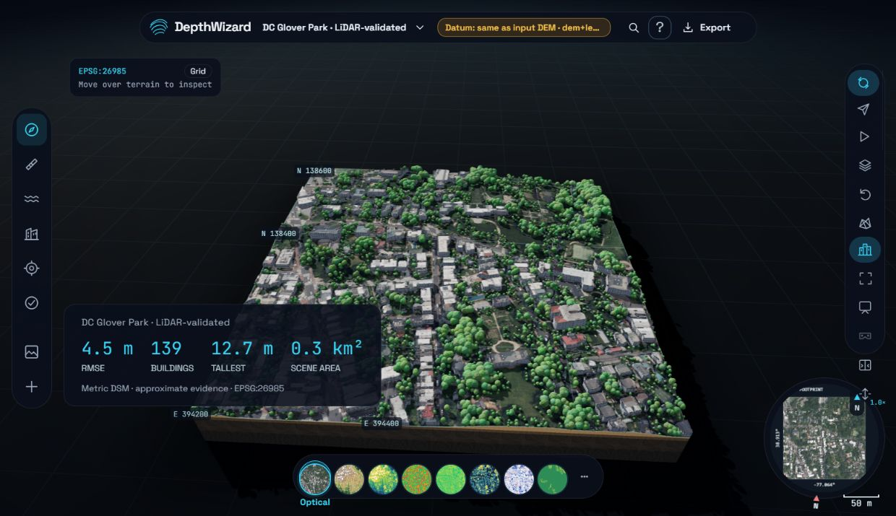
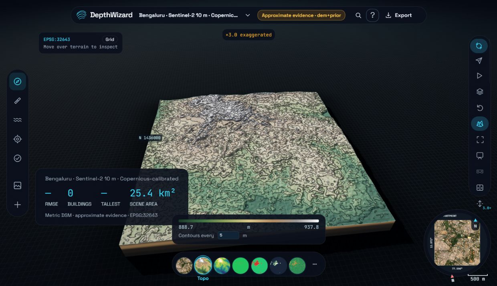
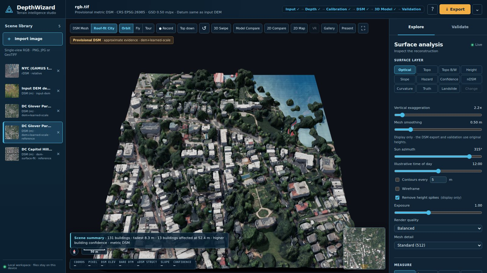
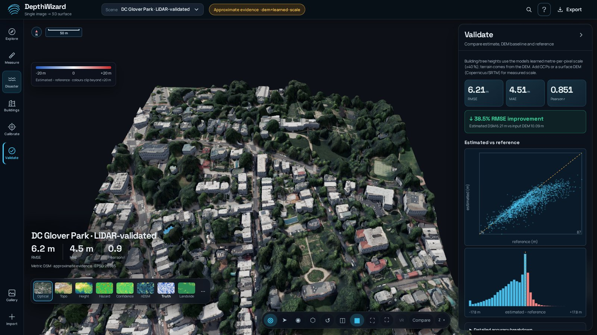
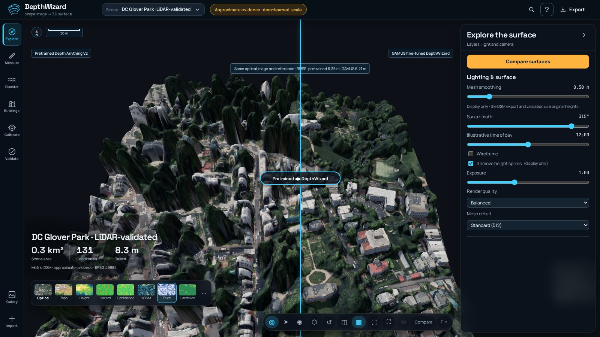
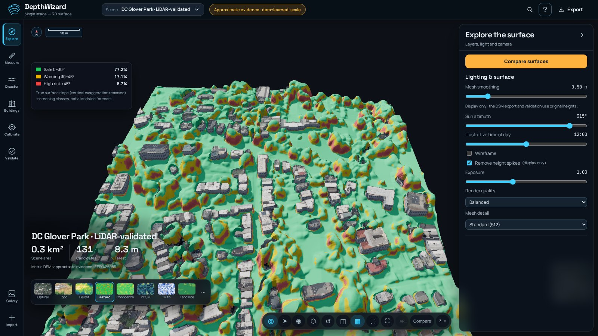
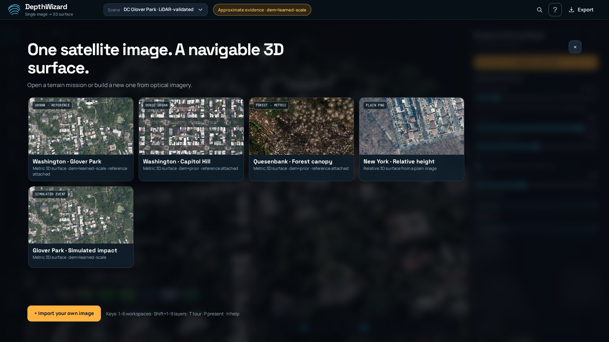
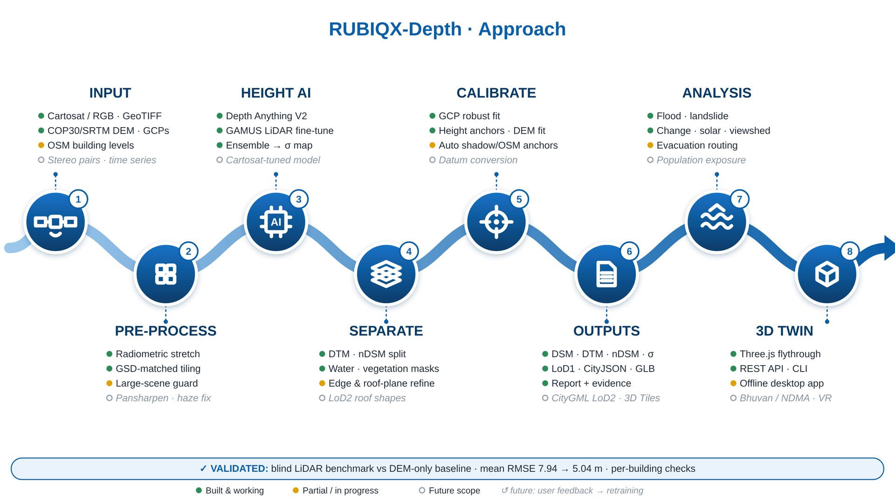

# DepthWizard · RUBIQX-Depth

**Turn a single optical image into an estimated elevation surface and an interactive
3D terrain workspace.** Built by Team RUBIQX for SIH 2026, PS 26175, ISRO / SAC.

[Quick start](#quick-start) · [Samples](#try-a-sample) · [Features](#features) ·
[Benchmarks](#accuracy-and-evidence) · [FAQ](#faq) · [Limitations](#limitations) ·
[Documentation](#documentation)



## Quick start

### Local application

Python 3.12 is the documented setup. From the repository root:

```powershell
python -m venv .venv
.venv/Scripts/python -m pip install -r requirements.txt
.venv/Scripts/python run.py
```

Open **http://localhost:8000** if the browser does not open automatically. Select a
saved gallery scene to explore the viewer, or choose **Import** to process an image.
Installation time depends on your connection and hardware.

For new metric inference, put the v6a Hugging Face checkpoint directory in
`models/da2-gamus-full`, or set `DEPTHWIZARD_CHECKPOINT` to its location. Checkpoints
are not included in the source repository. The import dialog identifies the local
model as **DepthWizard v6a · metric heights (recommended)**. Missing weights produce
a clear error; existing processed scenes can still be explored.

### Docker

```sh
docker compose up --build
```

Open port 8000. Compose mounts `data/` and `models/`; the image includes pretrained
Small weights, while the fine-tuned metric checkpoint must be supplied separately.
For other startup scripts, CLI options and deployment details, see
[Architecture and CLI](docs/ARCHITECTURE.md).

## Status

| Available locally | Still provisional or pending |
|---|---|
| v6a height inference, calibration, GeoTIFFs, 3D viewer and validation | Generalisation beyond evaluated domains; tall roofs and trees |
| Flood scenarios, surface-flow prototype, rescue screening and reports | Event-validated hydrology and field-verified route safety |
| Adaptive rendering, streamed Surface/Optical tiles, cancellable jobs | Broad uncertainty validation and independent Indian benchmarks |
| Docker and production configuration | Semantic model licensing and verified live AWS deployment |

The last recorded implementation checks on **4 October 2026** passed **90 Python
and 15 Node tests**. This is a dated local result. The historical
[AWS demo](http://16.170.173.94/) timed out during the latest checks; availability
and deployed revision are unverified. See [release readiness](docs/release-readiness.md).

## Approach

| Challenge | DepthWizard approach |
|---|---|
| Overhead imagery differs from street photography | Depth Anything V2 Base fine-tuned on GAMUS aerial and Urban 3D satellite data |
| Relative depth has no absolute height scale | Explicit DEM, GCP or height-anchor evidence, learned metric heights and recorded provenance |
| A convincing mesh can hide estimation error | Separate DSM values, display settings, reference scoring and calibration evidence |
| Response teams need usable outputs | Navigable terrain, screening tools and open geospatial exports |

These are design choices, not proof of superiority over every competing system.

## Try a sample

**Explore:** open a saved gallery scene to inspect navigation, layers and exports.
**Estimate:** import Glover Park RGB with its independent-date terrain input.
**Validate:** supply its 2024 LiDAR DSM only in the reference/scoring field.
**Check calibration plumbing:** use the synthetic image, DEM and GCPs.

<details>
<summary>Sample files and settings</summary>

| # | What it tests | Satellite image | Low-resolution DEM | Reference (scoring only) | Settings | What to expect |
|---|---|---|---|---|---|---|
| 1 | Urban scene, historical LiDAR diagnostic | `samples/dc_lidar/glover_park/rgb.tif` | `samples/dc_lidar/glover_park/dtm_2018_32m.tif` | `samples/dc_lidar/glover_park/lidar_dsm_2024.tif` | GAMUS model, scene prior *urban* | ~4.3 m RMSE vs ~10.1 m for the DEM alone (recorded Validate panel snapshot; use frozen versions for comparison) |
| 2 | Second urban site, terrain calibration | `samples/dc_lidar/capitol_hill_east/rgb.tif` | `samples/dc_lidar/capitol_hill_east/dtm_2018_32m.tif` | `samples/dc_lidar/capitol_hill_east/lidar_dsm_2024.tif` | GAMUS, *urban*, DEM kind *terrain* | Related-domain diagnostic; reserve the 2024 DSM for scoring and do not use reference-derived simulated DEMs to tune the current model |
| 3 | Change detection (simulated event) | `samples/dc_lidar/glover_park/rgb_post_simulated.tif` | `samples/dc_lidar/glover_park/dtm_2018_32m.tif` | – | GAMUS, *urban*; then **Disaster → Change detection**, pick the Glover Park scene as the before-event scene | height-loss patches where 12 roofs were removed from the image (the post-event image is **simulated**) |
| 4 | Forest / vegetation | `samples/quesenbank/forest_south_rgb.tif` | `samples/quesenbank/forest_south_dem_30m.tif` | `samples/quesenbank/forest_south_reference_dsm.tif` | GAMUS, scene prior *forest* | canopy DSM with error scored against the UAV reference. Always pair *north* files with *north* and *south* with *south* |
| 5 | Ground control points | `samples/synthetic/scene_rgb.tif` | `samples/synthetic/srtm_like.tif` | `samples/synthetic/truth_dsm.tif` | add `samples/synthetic/gcps.csv` as GCPs | calibration uses the GCP fit (synthetic scene with known truth) |
| 6 | Plain PNG, no georeference | `samples/gamus/NYC_00735_rgb.png` | – | – | horizontal pixel size **0.33** | relative heights only, clearly labelled as not metric |
| 7 | Existing elevation file | `samples/synthetic/srtm_like.tif` (as the image) | – | – | – | shown directly as *Input DEM (not estimated)*; no model runs |


</details>

Forest DEM and reference products share survey evidence; those results are not an
independent generalisation test. Simulated change and synthetic scenes test workflow
behaviour, not disaster prediction or real-world accuracy. Keep north/south files
paired. See [DC sample files](samples/dc_lidar),
[GAMUS samples](samples/gamus/README.md) and [forest samples](samples/quesenbank/README.md).

Automatic DEM retrieval needs internet or a suitable cache. Supplied DEM coverage
must meet the pipeline threshold. Anchors derived from a scoring reference invalidate
its status as an independent calibration holdout.

## Features

### Elevation and evidence

- PNG/JPG/TIFF imagery and georeferenced RGB input; unitless rDSM for plain imagery
  and metric output where calibration evidence supports it.
- Terrain/surface DEM handling, GCPs, known heights and available automatic
  OSM/shadow anchors; explicit calibration metadata and vertical datum handling.
- DSM, DTM and nDSM GeoTIFFs; metric uncertainty is provisional and ensemble spread
  requires multiple inference passes.
- Reference scoring with RMSE, MAE, bias, correlation, height-band/building
  diagnostics and an input-terrain baseline. References do not construct heights.

### Interactive terrain

- Orbit, Fly, Walk and cinematic Tour; minimap, coordinate grid, live coordinates,
  height probes, two-point profiles and linked image/height inspection.
- Optical, height, slope, contours, wireframe and reference-error views; vertical
  exaggeration, illustrative sun/time controls and presentation export.
- LoD1 buildings, roof fitting and dark green clustered tree crowns. Facades and
  individual tree geometry are illustrative, not measured reconstructions.
- Pretrained versus fine-tuned comparison, adaptive render quality, bounded tile
  streaming, recent views, bounded calibration undo and cancellable processing.
- GeoTIFF, GLB/OBJ, CityJSON, PLY, PDF/evidence reports and complete ZIP exports.

### Disaster and rescue screening

| Tool | What it provides |
|---|---|
| Flood scenarios | Connected static inundation or a level plane, affected structures and exposure estimates |
| Rainfall | Assumed-runoff playback plus a separate bounded surface-flow prototype with infiltration/drainage losses |
| Landslide | Slope/susceptibility screening and downslope runout paths |
| Evacuation and refuge | Candidate routes with access-mask handling and elevated shelter candidates |
| Population | Footprint/storey-based exposure estimates, explicitly approximate |
| Communications | Relay placement and geometric line of sight; not a radio propagation model |
| Change detection | Surface-height differences, including a labelled simulated sample |

Earthquake, cyclone, tsunami and wildfire simulations are not implemented. These
outputs support review and planning; they do not certify safe rescue operations.

### Experimental semantic separation

An optional overhead semantic model refines building/canopy masks without changing
DSM heights. It is disabled by default pending licensing and training-provenance
checks. Fewer candidate buildings do not establish better accuracy.
See [semantic prototype](docs/semantic-prototype.md).

## Accuracy and evidence

| Evaluation | RMSE | MAE | Correlation | Scope |
|---|---:|---:|---:|---|
| v6a metric AGL, 30 GAMUS test tiles | **2.61 m** | **1.47 m** | **0.84** | No per-tile reference fit; three US training-domain cities |
| Two DC urban DSM diagnostics | **3.64 m** | **2.62 m** | **0.87** | 2018 terrain calibration, 2024 LiDAR scoring; related-domain sites |
| Input DTM alone, same DC comparison | 9.04 m | 6.92 m | — | Terrain baseline, not a competing monocular model |

The GAMUS row measures above-ground height; the DC rows measure surface elevation.
They are different tasks and must not be combined. DC sites have been inspected
historically and are near training areas; they are not fresh geographically blind
holdouts. The same two scenes calibrated provisional uncertainty, so they cannot
independently validate that uncertainty model.

Additional documented tests include simulated panchromatic input (**2.76 m** at
0.6 m) and Urban 3D WorldView satellite test tiles (**1.66 m**, r **0.94**).
Simulated panchromatic input is not validation on Cartosat acquisitions. The older
six-scene **5.04 m** aggregate mixes calibration evidence and is neither an
independent benchmark nor the pretrained baseline on these DC scenes.

Find model versions, raw results, overlap/date caveats and failed experiments in
[Benchmarks](docs/BENCHMARKS.md) and the [model card](docs/MODEL_CARD.md).

## Gallery

| City reconstruction | Coarse terrain |
|---|---|
|  |  |
| Flood screening | Reference validation |
|  |  |

Screenshots are interface snapshots, not new benchmark results.

<details>
<summary>More interface and pipeline images</summary>






</details>

## FAQ

**Does it work offline?** Yes, with dependencies, selected model weights and required
DEM/geoid assets already local. The Three.js viewer is vendored. Live OSM, DEM
fetching and external basemaps still require a connection. To cache pretrained
models, run `python scripts/download_models.py small base`; this does not download
v6a weights or all geospatial assets.

**Can I use a plain PNG or JPG?** Yes. Without sufficient scale evidence, output is
relative and unitless. Entering horizontal pixel size does not establish absolute
vertical accuracy.

**Which DEMs can I use?** Supplied georeferenced terrain or surface rasters, including
CartoDEM, SRTM and Copernicus, subject to alignment and coverage. Public Copernicus
GLO-30 downloads use AWS tiles; optional OpenTopography routes have their own key
requirements. Copernicus/SRTM include surface objects and are not guaranteed bare earth.

**Do I need to train a model?** No training is needed to use a compatible existing
checkpoint. Reproducing or adapting the fine-tune is a separate workflow in
[TRAINING.md](TRAINING.md); training does not guarantee improvement on a new domain.

**Does the viewer change the measured heights?** Exaggeration and lighting are
presentation settings. Decimated meshes and illustrative objects must not replace
the full-resolution DSM in measurement workflows.

## Limitations

- Evaluation is concentrated in US urban data. Indian cities, real Cartosat
  imagery, hilly terrain and dense forests still need independent validation.
- Tall buildings, leaf-off trees, isolated crowns and textureless roofs remain
  difficult. Water and long shadows can confuse monocular inference.
- Height anchors can adjust global scale while leaving local shape errors.
  Copernicus height scaling and multi-scale blending remain off by default after
  inconsistent measured benefit. Recent training/ONNX candidates were not promoted.
- Uncertainty is calibrated on only two DC scenes. Building reliability is not an
  accuracy probability, and sparse control points do not provide survey certification.
- Relative output is unitless. Meshes are decimated; skewed ground pixels can affect
  local display geometry. Mission tools reject unsuitable metric distance frames.
- Static flood/playback assumptions and closed-boundary surface flow are simplified;
  no event validation, upstream inflow or sewer-network model is claimed. Routes,
  refuge, exposure and relay results require field verification.
- Inference errors stop processing. Explicit CLI heuristic fallback is labelled
  prototype-only and must not be counted as accuracy evidence.

See [failure cases](docs/images/failure_cases.jpg),
[limitation fixes](docs/limitation-fixes.md) and
[independent benchmark planning](docs/independent-benchmark.md).

## Documentation

- [Architecture, calibration, CLI and deployment](docs/ARCHITECTURE.md)
- [Viewer, navigation, layers and analysis](docs/VIEWER.md)
- [Training and datasets](TRAINING.md)
- [Model card and provenance](docs/MODEL_CARD.md)
- [Benchmarks and historical experiments](docs/BENCHMARKS.md)
- [Vertical datum handling](docs/vertical-datum.md)
- [Roadmap status](docs/ROADMAP_STATUS.md) and [4 October execution report](docs/roadmap-execution-20261004.md)
- [Indian benchmark acquisition plan](docs/india-benchmark-plan.md)
- [Release and live deployment checks](docs/release-readiness.md)
- [Contributing and evaluation integrity](CONTRIBUTING.md)

## Licence

Repository code is [MIT licensed](LICENSE). Model weights, imagery and datasets
have separate licences and redistribution conditions; verify them before reuse.
