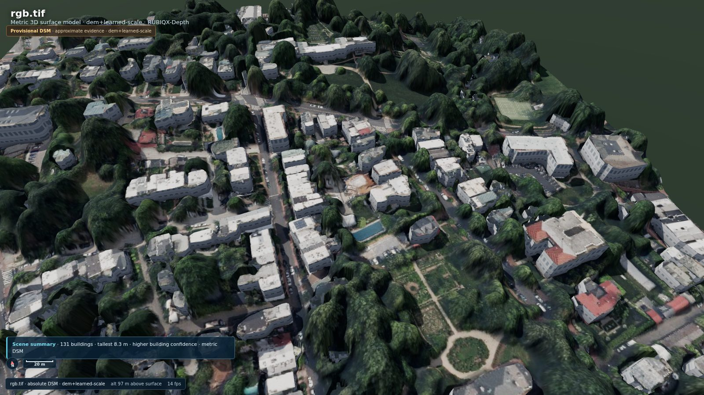
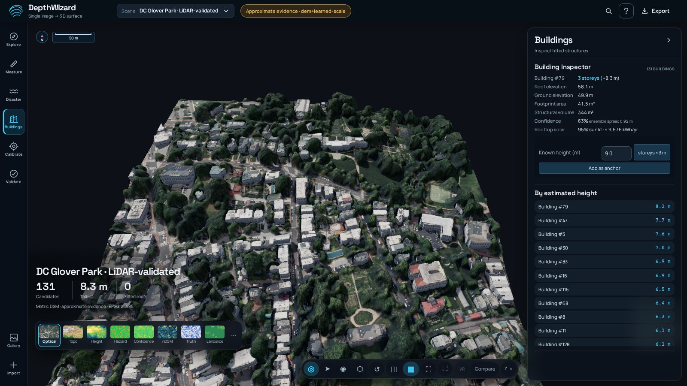
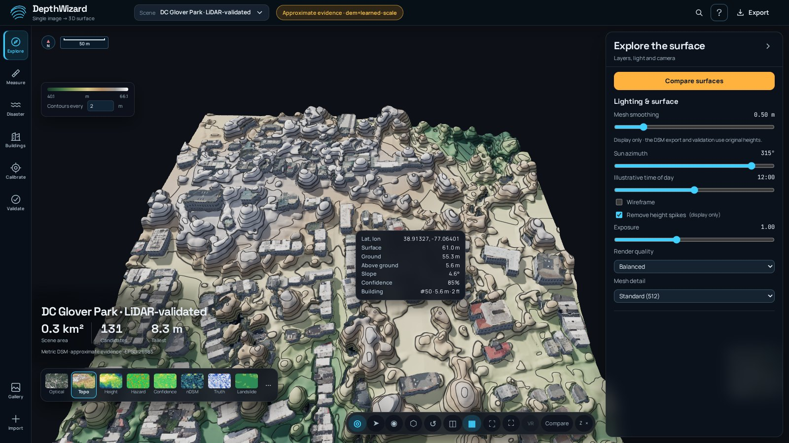

# RUBIQX-Depth (DepthWizard)

**One ordinary satellite image → a calibrated 3D surface model and a disaster-ready digital twin.**
Smart India Hackathon 2026 · Problem Statement 26175 (ISRO / SAC) · Team RUBIQX



| Absolute height, 30 held-out GAMUS tiles | Reference-held-out DC LiDAR check (2 scenes) | Runs offline |
|---|---|---|
| **3.46 m RMSE / 2.18 m MAE, r 0.79** – single image, **no per-tile fitting** (shape-aligned: 3.00 m; pretrained shape-aligned: 4.76 m, r 0.41) | **5.07 m RMSE / 3.74 m MAE** vs **9.04 m / 6.92 m** for the input DTM alone | one laptop, no cloud, open formats; [live demo](http://16.170.173.94/) |

The two DC scenes use a 2018 DTM for calibration and a 2024 LiDAR DSM only for
scoring. They are a small, related-domain evaluation because the sites are near
GAMUS DC training tiles. The older six-scene **5.04 m RMSE** aggregate includes
reference-derived simulated DEM inputs and same-survey forest DEMs; it is a
mixed-evidence pipeline check, not an independent accuracy result.

## Live demo

**http://16.170.173.94/** – hosted on AWS EC2 (CPU only). The demo scenes in the gallery open instantly; a new upload takes a few minutes to process because the server has no GPU. Use plain `http://`.

## Try it yourself – test and validation files

Every file below is in this repository, so you can download it, upload it through **Import** (on the live demo or a local run) and check the result against the included reference. The **Reference DSM / LiDAR** file is used only for scoring; it never enters the height estimate.

| # | What it tests | Satellite image | Low-resolution DEM | Reference (scoring only) | Settings | What to expect |
|---|---|---|---|---|---|---|
| 1 | Urban scene, blind LiDAR check | `samples/dc_lidar/glover_park/rgb.tif` | `samples/dc_lidar/glover_park/dtm_2018_32m.tif` | `samples/dc_lidar/glover_park/lidar_dsm_2024.tif` | GAMUS model, scene prior *urban* | ~6.2 m RMSE vs ~10.1 m for the DEM alone (Validate panel) |
| 2 | Surface-DEM calibration path | `samples/dc_lidar/capitol_hill_east/rgb.tif` | `samples/dc_lidar/capitol_hill_east/sim_cop30_surface.tif` | `samples/dc_lidar/capitol_hill_east/lidar_dsm_2024.tif` | GAMUS, *urban* | calibration method `dem-surface-fit`. The surface DEM is **simulated from the reference LiDAR**, so this checks the code path, not independent accuracy |
| 3 | Change detection (simulated event) | `samples/dc_lidar/glover_park/rgb_post_simulated.tif` | `samples/dc_lidar/glover_park/dtm_2018_32m.tif` | – | GAMUS, *urban*; then **Disaster → Change detection**, pick the Glover Park scene as the before-event scene | height-loss patches where 12 roofs were removed from the image (the post-event image is **simulated**) |
| 4 | Forest / vegetation | `samples/quesenbank/forest_south_rgb.tif` | `samples/quesenbank/forest_south_dem_30m.tif` | `samples/quesenbank/forest_south_reference_dsm.tif` | GAMUS, scene prior *forest* | canopy DSM with error scored against the UAV reference. Always pair *north* files with *north* and *south* with *south* |
| 5 | Ground control points | `samples/synthetic/scene_rgb.tif` | `samples/synthetic/srtm_like.tif` | `samples/synthetic/truth_dsm.tif` | add `samples/synthetic/gcps.csv` as GCPs | calibration uses the GCP fit (synthetic scene with known truth) |
| 6 | Plain PNG, no georeference | `samples/gamus/NYC_00735_rgb.png` | – | – | horizontal pixel size **0.33** | relative heights only, clearly labelled as not metric |
| 7 | Existing elevation file | `samples/dc_lidar/glover_park/lidar_dsm_2024.tif` (as the image) | – | – | – | shown directly as *Input DEM (not estimated)*; no model runs |

Tips: tick **Auto-download DEM** instead of giving a DEM file to fetch Copernicus/SRTM automatically (needs internet). A DEM must cover at least 90% of the image or the run stops with a clear message instead of guessing. On any scene, **Buildings → Known height → Add as anchor**, then **Calibrate → Scale Anchors → Apply**, rescales the whole scene from one supplied building height; if that height comes from the reference file, the result is no longer a blind test.

## Quick start

```bash
# Windows (Python 3.12)
py -3.12 -m pip install -r requirements.txt
py -3.12 run.py                     # opens http://127.0.0.1:8000

# Docker (any OS) – one command
docker compose up --build           # then open http://localhost:8000
```

The first visit opens a gallery of demo scenes. Put the fine-tuned checkpoint in
`models/da2-gamus-full` (or `D:/DepthWizard/checkpoints/da2-gamus-full`) and it is used automatically.

## Gallery

| **Buildings** – 131 fitted buildings with height, storeys, volume, estimated solar; supplied heights can recalibrate the scene | **Topo** – hypsometric tint + index contours + hillshade |
|---|---|
|  |  |
| **Slope hazard** (true slope, 0–30° / 30–45° / >45°) | **Flood & response** – connected flood, buildings and people exposed, mission planning |
|  |  |
| **Model Compare** – pretrained Depth Anything V2 vs our GAMUS fine-tuned model, same image | **Validate** – blind LiDAR check: 38.5% lower RMSE than the input DEM |
|  |  |
| **Demo gallery** – one click to a ready scene | |
|  | |

## How it works


## PS 26175 alignment

| Requirement | How RUBIQX-Depth meets it |
|---|---|
| Non-georeferenced RGB → relative DSM | Depth Anything V2 fine-tuned on GAMUS LiDAR; rotation ensemble; `rdsm.tif` clearly labelled relative |
| Georeferenced RGB → absolute DSM (m) | Evidence-ranked calibration: GCPs → known building heights → surface DEM (auto surface/bare-earth detection) → learned scale → scene prior; every output states which it used |
| Scale calibration | Interactive ground-control pins with live R², RMSE and leave-one-out error (turns a relative scene metric); height anchors; CSV GCPs |
| 3D visualisation | Three.js digital twin: textured terrain + LoD1/fitted roofs, orbit/fly/tour, Topo and slope-hazard modes, live hover readout, DEM-vs-DSM swipe, cinematic quality (ambient occlusion, sky), presentation mode, one-click video |
| Validation | Two reference-held-out DC LiDAR scenes against a DEM-only baseline, per-building checks, uncertainty coverage test, and separately labelled mixed-evidence checks ([benchmarks](docs/BENCHMARKS.md)) |
| Disaster management | Connected flood with buildings and people affected, landslide index, pre/post change detection, evacuation routes, refuges, runout, relay coverage |
| GIS interoperability | GeoTIFF DSM/DTM/nDSM/σ, CityJSON, GLB, OBJ, PLY, 8/16-bit heightmap PNG, HTML/PDF report, evidence JSON, one-click export-all ZIP |

## How we differ from a typical single-image pipeline

| | Typical approach | RUBIQX-Depth |
|---|---|---|
| Height model | Off-the-shelf depth model trained on street-level photos | Fine-tuned on aerial LiDAR above-ground height |
| Metres | Assumed, hand-scaled, or only after manual pins | Automatic calibration from the best available evidence, always labelled |
| Existing DEM input | Displayed as if it were an estimate | Shown as *Input DEM (not estimated)*; used only for calibration of image estimates |
| Uncertainty | None | Per-pixel map and per-building confidence (ranks reliability; see benchmarks §5) |
| Proof | Screenshots | Reference-held-out two-scene LiDAR check vs the DEM-only baseline, with calibration provenance |

## New in v3 (viewer and workflow)

- **Rendering:** ACES tone mapping, tightly fitted soft shadows, crisp hillshade from a full-resolution normal map, 512/1024 mesh detail, display-only spike removal, Cinematic quality (ambient occlusion, SMAA, physical sky, hazy ground), animated depth-tinted flood water, building walls with floors and windows.
- **Layers:** Topo (hypsometric tint + index contours + hillshade, colour or B/W) and 3-class slope hazard with area shares; vertical exaggeration up to 25×.
- **Workflow:** live hover readout (lat/lon, surface, ground, height above ground, slope, confidence, building), double-click fly-to, zoom to cursor, click-to-pin ground-control points with R²/RMSE/leave-one-out, demo gallery, presentation mode (P), shareable `#scene` links, toasts instead of pop-ups, render-on-demand to keep laptops cool.
- **Inputs/outputs:** single-band DEM GeoTIFFs are visualised directly and labelled *Input DEM (not estimated)*; 8/16-bit heightmap PNG; export-all ZIP; report "Save as PDF" button; Docker compose.

## Highlights (v2.2)

| | |
|---|---|
| **Accuracy** | Reference-held-out, related-domain DC LiDAR evaluation: **5.07 m RMSE / 3.74 m MAE**, Pearson **r = 0.819** over two urban scenes, vs **9.04 m / 6.92 m** for the input DTM alone ([benchmarks](docs/BENCHMARKS.md)). The six-scene 5.04 m mixed-evidence aggregate is reported separately, not as independent validation. GAMUS fine-tune: correlation 0.41 → 0.79 on 30 held-out tiles after per-tile reference alignment. |
| **Calibration** | Detects whether the DEM is a surface model (Copernicus/SRTM) or bare earth; fits building scale from a surface DEM and matches it exactly at 30 m; otherwise uses GCPs, a learned pixel-footprint scale or a scene prior, always labelled. |
| **Products** | DSM, DTM, nDSM and per-pixel uncertainty GeoTIFFs · CityJSON with LoD1 or supported fitted LoD2 roofs · GLB/OBJ/PLY · HTML report · evidence JSON |
| **3D** | Textured city on bare ground, fitted roof hypotheses, adjustable sun lighting, geometric DEM-vs-DSM swipe, orbit/fly/tour, one-click flythrough video |
| **Analysis** | Connected flood (edge / clicked source) with depth, volume and buildings affected · landslide susceptibility · viewshed · rooftop solar · pre/post change detection · profiles, 3D distance, cut/fill |
| **Engineering** | 12 automated tests + CI, REST API with `/docs`, ONNX export, PyInstaller build script, [model card](docs/MODEL_CARD.md), [roadmap status](docs/ROADMAP_STATUS.md) |

### Mission workbench additions

- **Automatic height cues:** on metric scenes with separate DTM/nDSM, candidate per-building heights come from RGB shadow length and solar elevation or matched OpenStreetMap `height` tags. OSM `building:levels` uses a 3 m/storey heuristic. Shadow candidates are rejected when they cross another building or open water. Only at least three consistent, sufficiently confident explicit-height/shadow anchors change scale automatically; metadata records every candidate, rejection, source, and whether a rescale occurred. User-supplied GCPs or a measured DEM calibration take precedence. These cues are provisional estimates, not validation truth.
- **Building geometry:** RGB edges guide footprint detection without changing the original DSM or its validation scores. Flat, tilted-plane and gable roof hypotheses are rendered in the Roof-fit City view. CityJSON records fitted pitched roofs as LoD 2.0 solids when supported and otherwise falls back to LoD1; this does not mean surveyed LoD2 accuracy.
- **Disaster screening:** a full-resolution metric API computes flood-avoiding routes to high ground, vertical refuge candidates, an occupancy proxy based on floor area, downhill landslide traces, and relay line-of-sight coverage. The browser animates routes and runout paths. A rainfall slider animates a connected flood using a 60% runoff fraction over the scene footprint; it is not a hydrologic forecast. Routes, shelters, population and radio coverage need field verification.
- **Presentation and evidence:** buildings rise when Roof-fit City opens, an illustrative time slider moves lighting and shadows, the Truth mode shows signed errors against an uploaded reference, and the scene summary appears in the viewer and report. A same-image pretrained-vs-GAMUS 3D swipe runs the off-the-shelf model on demand and only appears when both outputs align and use the same units. Geo scenes can open a synchronized OpenStreetMap pane with attribution. Immersive VR activates only in a supported headset and browser on a secure origin or localhost.

The local mission endpoint is `POST /api/scenes/{id}/mission` with actions `route`, `shelters`, `population`, `runout`, and `relay`. It requires a local projected metre CRS with less than 2% ground-scale distortion and aligned full-resolution DSM/DTM; Web Mercator is rejected for ground distances. `/api/scenes/{id}/auto-anchors` refreshes available candidate evidence for an existing scene; `/api/scenes/{id}/model-comparison` prepares or reports the off-the-shelf comparison.

## Other ways to start

```bash
# Linux / macOS
./start.sh
# Windows
start.bat
```

This creates a virtual environment, installs the requirements and opens <http://127.0.0.1:8000>. Two synthetic demo scenes are pre-loaded.

To run it **offline**, first run `python scripts/download_models.py small base`. That caches the model weights once.

### Command line

The general form is `python -m depthwizard IMAGE [options]`.

Plain PNG, giving a relative DSM (`rdsm.tif`):

```bash
python -m depthwizard scene.png --gsd 0.6 -o out/
```

GeoTIFF with a DEM, giving an absolute DSM in metres (`dsm.tif`):

```bash
python -m depthwizard scene.tif --dem cop30.tif -o out/
```

The same, but downloading the DEM automatically. This needs a free OpenTopography API key:

```bash
export OPENTOPO_API_KEY=...
python -m depthwizard scene.tif --fetch-dem --dem-source COP30 -o out/
```

Adding ground control points and validating against a reference:

```bash
python -m depthwizard scene.tif --dem cop30.tif --gcp gcps.csv --ref lidar.tif --model base -o out/
```

Each run writes these files to the output folder:

| File | Contents |
|---|---|
| `dsm.tif` / `rdsm.tif` | Float32 DSM, same CRS and transform as the input, deflate-compressed |
| `metrics.json` | Validation scores (only when `--ref` is given) |
| `preview.png` | Colour-relief hillshade image |
| `viewer/` | Assets for the 3D viewer |

## Pipeline details

### 1. Elevation extraction (`depthwizard/depth.py`)

The backbone is Depth Anything V2. You can use Small, Base or Large, or your own fine-tuned checkpoint.

Satellite scenes are much larger than the network's 518 px input, so it runs in two passes:

- **Global pass:** the whole scene, downsampled. This gives consistent large-scale structure.
- **Tile pass:** overlapping 1024 px tiles at full resolution. This gives fine detail.

Each tile's own arbitrary scale and shift is re-aligned to the global pass by least squares. The tiles are then blended with feathered edges, so no seams appear.

The network outputs inverse depth, where larger means closer to the camera. In a nadir view, closer means higher, so the output is used directly as relative height.

### 2. Scale calibration (`depthwizard/calibrate.py`)

The method is chosen automatically from what you supply.

| Inputs | Method | Formula |
|---|---|---|
| GeoTIFF + DEM | **DEM fusion** | `DSM = DEM_terrain + k · max(highpass(rel) − ground_anchor, 0)` |
| GeoTIFF + DEM + GCPs | DEM fusion, *k* from GCPs | Terrain from the DEM; structure scale fitted to the surveyed points |
| Any image + GCPs | Robust affine | `DSM = a · rel + b`, fitted with Huber IRLS |
| PNG / JPG | Relative | rDSM in the range [0, 1] |

**Why fusion.** A 30 m DEM (SRTM, Copernicus GLO-30 or CartoDEM) gets the absolute datum and the large-scale relief right. It cannot see buildings or trees. The network sees exactly those, but has no scale.

The DEM is reprojected onto the image grid and supplies the bare-earth terrain and datum. A lower-tail anchor makes the network's high-pass structure nonnegative, so the estimated surface does not systematically fall below the DEM. This is still an estimate of a surface, and its quality depends on the DEM, model transfer, and scale source.

The structure scale *k* comes from the first source that works:

1. The GCPs, if you supplied them.
2. A robust fit of the low-passed network output against the DEM, used only when that fit correlates well.
3. A scene-level prior: `--scene urban|sparse|forest|hilly`.

Calibration metadata records the DEM coverage, scale source, and evidence level. A weak DEM fit triggers a scene prior and labels the output **approximate**. GCP fits record in-sample residuals separately from leave-one-out error and mark sparse or clustered GCP configurations provisional; six distributed points with stable leave-one-out error support a stronger claim. An independent reference DSM or LiDAR set is still needed to measure accuracy.

### 3. Validation (`depthwizard/metrics.py`)

It reports these scores:

- RMSE, MAE, bias, NMAD and Pearson r.
- Edge-gradient RMSE and error by reference height above ground (with DEM baseline rows).
- The share of pixels within 1, 2 and 5 m.
- An affine-aligned score, which is the fair score for a relative DSM.
- An nDSM score: height above ground, with terrain removed, to test structure recovery.
- A **baseline**: the same scores for the input DEM alone. Beating this baseline shows the network adds value.

Results are also broken down per landscape class (urban, sparse, hilly, forest). The class of each tile is decided from the reference surface and a vegetation index.

### 4. Domain adaptation (`scripts/finetune_gamus.py`)

This script fine-tunes Depth Anything V2 on GAMUS, or any other RGB + height dataset. It uses:

- A scale-and-shift-invariant L1 loss.
- Multi-scale gradient matching, for sharp building edges.
- Rotation and flip augmentation.
- A lower learning rate for the encoder than the decoder.

It reads GAMUS's original HDF5 RGB/AGL pairs, supports gradient accumulation for an 8 GB GPU, and saves a resumable checkpoint each epoch. See [TRAINING.md](TRAINING.md) for the verified laptop setup, dataset downloader, short trial, 10-epoch command, and held-out evaluation. Use the trained checkpoint with `--model PATH_TO_CHECKPOINT`.

### 5. Batch evaluation (`scripts/evaluate_batch.py`)

```bash
python scripts/evaluate_batch.py manifest.csv --model base -o eval_out
```

The manifest columns are `image,reference[,dem][,gcp][,scene]`. The script writes:

- `results.csv`, with one row per scene.
- `summary.json`, with mean RMSE, MAE and r overall and per landscape class.

## 3D viewer (`web/`)

It uses Three.js, vendored locally, so no CDN is needed and it works offline.

The app opens into **Terrain Mission Control**: a full-bleed 3D scene, a compact mode rail, a contextual tool drawer, a thumbnail layer dock, and an evidence status chip. The scene gallery highlights six contrasting examples; the scene picker still lists every local job. Import uses a three-step side sheet for image, scale/reference evidence, and processing. On narrow screens the tool drawer moves below the scene. A linked comparison keeps source RGB and estimated height aligned at the same pixel.

| Feature | Details |
|---|---|
| Navigation | **Orbit**; **Fly** (first-person, pointer-lock, WASD/QE/Shift, never drops below the terrain); **Tour** (automatic flythrough); **Top down** and **Fullscreen**; a minimap you can click to jump |
| Surfaces | Optical drape, height colour ramp, slope (° for metric DSMs; relative gradient otherwise), curvature, error vs a metric reference; contour lines; wireframe |
| Controls | Vertical exaggeration; display-only mesh smoothing; sun azimuth and illustrative time of day |
| Comparison | Linked source RGB and height maps with a shared cursor; clicking a pixel sets the 3D height probe |
| Probe | Estimated height, reference height, error, slope, aspect, and map coordinates (E/N) for georeferenced scenes |
| Profile | Two clicks draw an elevation cross-section: estimate vs reference, length, Δh, grade, profile RMSE |
| Analysis | Connected flood scenarios from the lowest scene edge or a clicked source, a separate level-plane option, rainfall playback, estimated building and population exposure, route and refuge screening, landslide runout, and relay line of sight. Mission analysis requires an aligned DTM and local projected metre CRS. With a metric reference DSM, cut/fill volumes compare the estimated and reference surfaces. |
| Validate mode | RMSE/MAE/r cards, a DEM baseline comparison, estimated-versus-reference plots, and expandable per-landscape, height-band, edge-gradient, and calibration details |
| Export | Grouped raster, 3D, and evidence actions: GeoTIFF, textured GLB/OBJ, CityJSON, PLY, report, a complete ZIP, and a provenance-stamped viewer screenshot |
| Keyboard | 1–6 workspaces; Shift+1–9 surface layers; O/F/T/D/V/R for navigation; G gallery; E export; Ctrl+K action search; H help |

## Deployment

- **Local app:** `start.sh` / `start.bat`. This is a locally hosted web app, which the FAQ accepts.
- **Docker:** `docker build -t depthwizard . && docker run -p 8000:8000 depthwizard`. The model weights are baked into the image.
- **Desktop executable (optional):** `pip install pyinstaller` then:

  ```
  pyinstaller --onedir --add-data "web:web" --add-data "data:data" --collect-all transformers run.py
  ```

## Repository notes

- `data/jobs/` and `samples/*/evaluation/` contain processed demo scenes (GeoTIFFs and viewer `.bin` files) on purpose: the gallery, the live demo and the validation panel open instantly without a GPU, and every reported number can be checked against the stored outputs. New jobs you create are git-ignored.
- Model and dataset locations are settings, not hard-coded paths: put the checkpoint in `models/da2-gamus-full` or set `DEPTHWIZARD_CHECKPOINT`; set `DEPTHWIZARD_GAMUS_ROOT` for the GAMUS evaluation and `DEPTHWIZARD_TRAINING_ROOT` for training outputs.
- `pytest -q tests` runs 28 tests covering calibration, anchors, rescaling, the job queue, disaster tools, uncertainty calibration and the GAMUS scoring modes.

## Test data

`scripts/make_synthetic_scene.py` generates a fully known scene. It contains:

- A georeferenced RGB image in UTM 43N at 0.5 m GSD.
- A ground-truth DSM.
- A coarse "SRTM-like" 30 m DEM with noise.
- A GCP CSV.

This lets every mode and metric be checked without any downloads. It is a plumbing test, not an accuracy claim.

Two real GAMUS RGB/AGL test pairs are ready in [samples/gamus/](samples/gamus/README.md), with provenance, upload instructions, and a measured pretrained baseline. Two georeferenced forest crops with RGB, a 30 m DEM, and a reference DSM are ready in [samples/quesenbank/](samples/quesenbank/README.md). Those crops exercise the absolute DSM route, but broader independent LiDAR evaluation is still needed for an accuracy claim.

On those two Quesenbank crops, the fine-tuned model with the nonnegative DEM-fusion calibration has a mean absolute DSM RMSE of **6.70 m** and MAE of **3.60 m**, versus **7.79 m** and **4.93 m** for the prior fusion method. Both methods use a 30 m DEM downsampled from the same survey's high-resolution DEM, so this is a cross-landscape pipeline check, not independent LiDAR validation. The 30 GAMUS held-out test tiles have mean affine-aligned RMSE **3.00 m** versus **4.76 m** for the pretrained Small backbone; that alignment uses each test tile's AGL reference and measures relative shape only. Scored with **no alignment at all** – the fine-tuned model's own metric output – the same tiles give **3.46 m RMSE, 2.18 m MAE, r 0.79**, with tall objects about 18 % too low on average (details and per-city numbers in [docs/BENCHMARKS.md](docs/BENCHMARKS.md), raw results in `docs/eval/gamus30/`).

## Known limitations

- **Evaluation breadth.** Absolute accuracy is measured on 30 GAMUS tiles from three US cities and two DC LiDAR scenes near the training region. There is no Indian, Cartosat, hilly or dense-forest validation yet; that is the top priority, followed by more non-urban LiDAR sites.
- **Building heights.** Tall objects are under-estimated (about 30 % low on DC/NYC GAMUS tiles; median 4.3 m vs 9.4 m on Glover Park buildings when only the learned scale is available). One supplied height or a few GCPs correct most of this.
- **Uncertainty.** `uncertainty.tif` is a calibrated 1-sigma error fitted on only two scenes (held-out 1σ coverage 52–88 %); treat it as provisional. The viewer's confidence layer is a relative reliability index, not a probability.

- Monocular height is weakest on:
  - Uniform flat roofs, where there is little texture.
  - Water.
  - Scenes lit by a low sun, where long shadows are confused with height.
- Fine-tuning on overhead data (GAMUS) is the main lever for all of these.
- The scene prior for *k* is a fallback and yields approximate metric heights. Sparse GCPs yield provisional calibration even if their in-sample residual is small.
- Relative viewer geometry uses a display-only vertical scale to make the flythrough legible. The rDSM GeoTIFF and reported probe values remain unitless; no reference DSM is used to shape relative viewer geometry.
- Mesh exports are decimated to at most 512 samples along their longest side. Relative exports are explicitly unitless; neither mesh export replaces the full-resolution DSM GeoTIFF.
- Building roof pitch and the 3D local frame assume approximately square ground pixels. Strongly skewed or unequal-axis GeoTIFF pixels can distort this display geometry; the mission API rejects scenes whose ground-distance scale is unsuitable.
- Flooding is a connected static bathtub calculation over the estimated bare-ground DTM, or an optional all-cells level plane. Rainfall playback assumes 60% runoff over the scene footprint; neither mode simulates drainage, levees, upstream inflow or flood duration. Evacuation, shelter, population, runout and relay outputs are planning screens, not safety certification. Cut/fill is not a surveyed earthwork quantity.
- If the model weights cannot be loaded, the pipeline falls back to a crude heuristic so the rest of the app still runs. The viewer flags this, and `--no-fallback` disables it.
