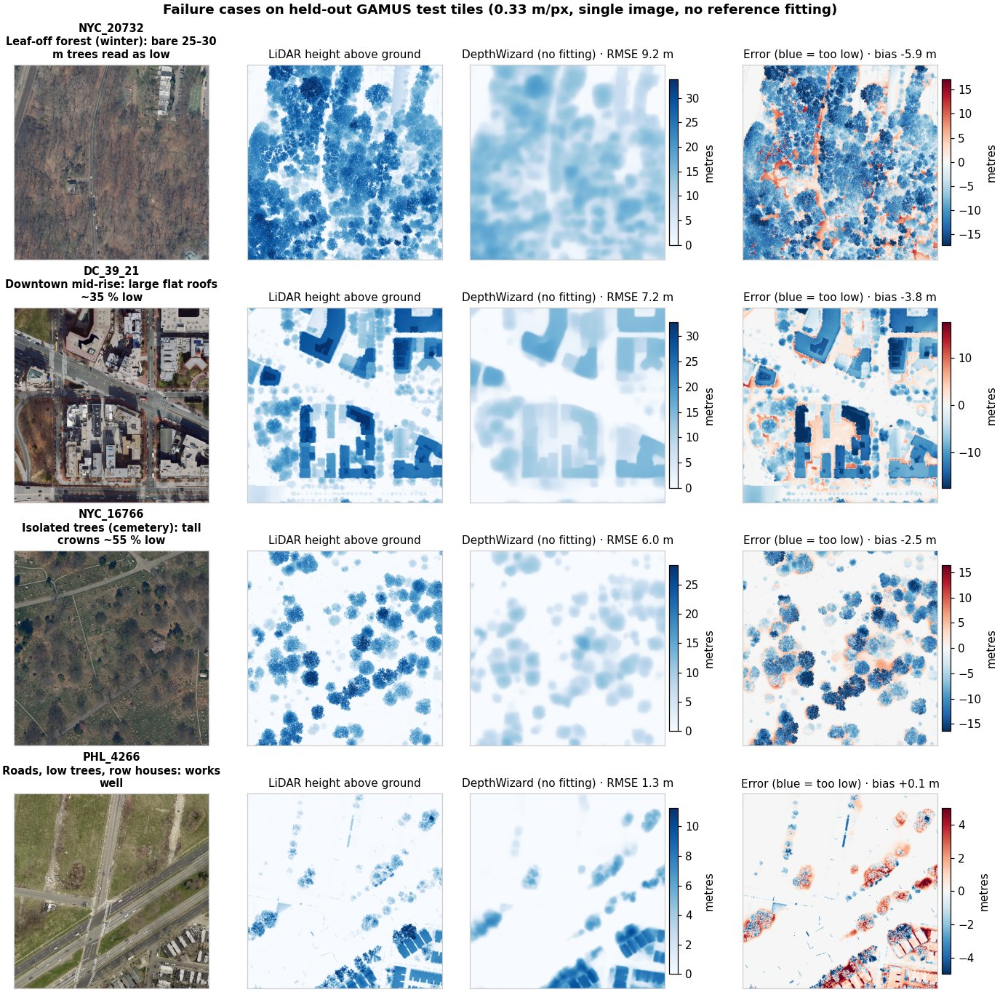

# DepthWizard benchmarks

The DC two-scene result below was rerun with the GAMUS fine-tuned checkpoint
(`da2-gamus-full`, 10 epochs, RTX 4060) using the checked-in
`samples/dc_lidar/manifest.csv` and `samples/dc_lidar/evaluation/` outputs.
"Reference held out" means the 2024 LiDAR DSM was used for scoring only, not
to construct the calibration input or height anchors. Other rows are labelled
by the evidence they use; they must not be pooled into a blind accuracy claim.

## 1. Relative height shape – 30 held-out GAMUS test tiles

Scale and offset fitted per tile to the AGL reference (shape diagnostic, not
absolute accuracy). Test tiles were never used for training or validation.

| Backbone | Mean RMSE | Mean MAE | Mean r |
|---|---:|---:|---:|
| Depth Anything V2 Small (pretrained) | 4.76 m | 3.71 m | 0.41 |
| **DepthWizard GAMUS fine-tune** | **3.00 m** | **1.90 m** | **0.79** |

All 30 tiles improved. Results: `docs/eval/gamus30/` (rows marked `[aligned]`).

### 1b. Absolute height – same 30 tiles, **no fitting to the reference**

The fine-tuned checkpoint's own metric output (learned pixel-footprint scale
C = 0.674, fitted on GAMUS *validation* tiles, never on these test tiles)
scored directly against the LiDAR AGL. Nothing is fitted per tile, so this is
the honest single-image number. 0.33 m/px, TTA 1.

| Tiles | RMSE | MAE | r | Mean bias | Median est/ref height, objects > 3 m |
|---|---:|---:|---:|---:|---:|
| DC (10) | 4.88 m | 3.20 m | 0.84 | −1.52 m | 0.71 |
| NYC (10) | 3.52 m | 2.31 m | 0.66 | −0.92 m | 0.70 |
| PHL (10) | 1.99 m | 1.01 m | 0.88 | −0.03 m | 0.98 |
| **All 30** | **3.46 m** | **2.18 m** | **0.79** | **−0.82 m** | **0.82** |

Absolute RMSE is only 0.46 m worse than the shape-aligned score, so the learned
scale transfers to unseen tiles. The remaining error is mostly a height
*under*-estimate of tall objects (about 30 % low in DC and NYC), the same
building bias seen in §3. The pretrained backbone cannot be scored this way
because it has no metric output. All tiles are US cities (DC, New York,
Philadelphia); this is not evidence for Indian scenes.

### 1c. Failure cases



The four rows are the three worst test tiles and one typical good tile. Errors
concentrate on **tall vegetation and large flat roofs**, which come out too low:

* **NYC_20732 – leaf-off forest (9.2 m RMSE).** Bare winter trees 25–30 m tall
  read as a low, smooth canopy; there is little texture to anchor height.
* **DC_39_21 – downtown mid-rise (7.2 m).** Footprints are right but large flat
  roofs are about 35 % low.
* **NYC_16766 – isolated cemetery trees (6.0 m).** Crowns are found but about
  55 % too low.
* **PHL_4266 – roads, low trees, row houses (1.3 m).** Typical low-rise scenes
  are accurate, with a small positive bias on tree crowns.

The prediction is also smoother than LiDAR (fine crown texture is lost), which
adds error at object edges.

### 1d. Negative results (what we tried that did not help)

* **Post-hoc height correction.** A single gain, a gain above a height
  threshold, and a power curve were fitted on 40 GAMUS *validation* tiles and
  scored on the 30 test tiles. The best improved test RMSE from 3.46 m to
  3.44 m – within noise – so no correction is applied. On validation tiles the
  learned scale is already close to optimal (tall objects at 0.90 of true
  height); the larger shortfall on test tiles comes mainly from NYC, a city not
  in the validation set. Reproduce with `scripts/check_height_correction.py`.
* **Resolution on the DC scene.** On Glover Park the raw model already predicts
  buildings at 0.45 of their LiDAR height (the pipeline adds no loss: 0.44
  after calibration). Resampling the image to 0.25–0.5 m/px gives the same
  0.45, because tiling normalises the network's view. A likely cause is the
  imagery type: the DC 2023 mosaic appears close to a true orthophoto with
  little visible building lean, while GAMUS tiles show facades that the model
  uses as a height cue. This is a hypothesis, not yet tested; a height anchor or
  GCPs correct it in practice (§3).

## 2. Absolute DSM – reference-held-out DC LiDAR evaluation

Two urban scenes use 2023 optical imagery and a **2018 bare-earth DTM averaged
to 32 m** for calibration; the **2024 LiDAR DSM** is used only as the reference.
The mean absolute DSM error is **5.07 m RMSE, 3.74 m MAE, Pearson r = 0.819**
(versus **9.04 m RMSE, 6.92 m MAE** for the input DTM alone). These are scene
means, not a pixel-pooled score. See `samples/dc_lidar/evaluation/summary.json`
and the per-scene `metrics.json` files; source URLs and file hashes are in
`samples/dc_lidar/provenance.json`. The sites are close to GAMUS DC training
tiles, so this is a small related-domain check, not a held-out geographic
generalization study.

### Additional pipeline checks (mixed calibration evidence)

The following six-scene aggregate includes two simulated surface DEMs created
by downsampling the **same 2024 LiDAR DSM used for scoring**, plus two forest
DEMs from the same survey as their DSM reference. It measures pipeline behavior
under those inputs; **5.04 m RMSE / 3.52 m MAE is not an independent accuracy
result**. The separately listed LiDAR-anchored Glover Park run is excluded from
that six-scene mean.

| Scene | Calibration evidence | Reference | DEM only RMSE / MAE | Previous build RMSE / MAE | **Current** RMSE / MAE | r |
|---|---|---|---:|---:|---:|---:|
| DC Glover Park (urban) | 2018 DTM, 32 m; reference held out | DC 2024 LiDAR DSM | 10.09 / 7.42 | 9.17 / 7.43 | **6.21 / 4.51** | 0.85 |
| DC Capitol Hill East (urban) | 2018 DTM, 32 m; reference held out | DC 2024 LiDAR DSM | 8.00 / 6.41 | 7.89 / 6.64 | **3.93 / 2.97** | 0.79 |
| DC Glover Park (3 LiDAR building anchors; excluded from mean) | Heights from the scoring LiDAR | DC 2024 LiDAR DSM | 10.09 / 7.42 | - | **4.23 / 2.99** | 0.89 |
| DC Glover Park | Simulated surface DEM from scoring LiDAR* | DC 2024 LiDAR DSM | 5.74 / 4.62 | 4.44 / 3.40 | **4.60 / 3.64** | 0.86 |
| DC Capitol Hill East | Simulated surface DEM from scoring LiDAR* | DC 2024 LiDAR DSM | 4.57 / 3.79 | 3.95 / 3.19 | **3.91 / 3.18** | 0.61 |
| Quesenbank forest north | 30 m DEM from same survey | UAV survey DSM | 9.06 / 3.92 | 7.99 / 4.50 | **6.25 / 3.50** | 0.76 |
| Quesenbank forest south | 30 m DEM from same survey | UAV survey DSM | 10.15 / 4.88 | 8.90 / 5.12 | **5.36 / 3.34** | 0.89 |
| **Mixed-evidence mean (six scenes)** | | | **7.94 / 5.17** | **7.06 / 5.05** | **5.04 / 3.52** | |

\* LiDAR DSM averaged to 30 m plus N(0, 2 m) noise – a stand-in for
Copernicus GLO-30 over this site, used only to exercise the surface-DEM path.
Because the scoring LiDAR created this input, those two rows are not
reference-independent, even though noise was added.
"Previous build" = the 29 Sep 23:45 laptop build (high-pass structure, fixed
canopy factor, 30 m matching applied to every DEM type).

What changed between the previous and current build:

1. **DEM type detection.** The previous build forced the output to average to
   the DEM even when the DEM was bare earth, pulling buildings down. The
   current build tests whether the DEM "sees" buildings (correlation of its
   high-pass with the model's structure map) and only enforces 30 m
   consistency for surface DEMs (Copernicus, SRTM).
2. **Above-ground structure.** The GAMUS model predicts height above ground,
   so structure is taken from its lower tail instead of a high-pass (nDSM
   correlation with LiDAR 0.65 → 0.77 in Glover Park).
3. **Learned metric scale.** Raw model output × pixel footprint × 0.674
   (fitted on 23 GAMUS *validation* tiles) gives approximate metres, used when
   no GCP or surface DEM provides a measured scale. Scenes are tiled so the
   network sees ~0.65 m per input pixel, as in training.
4. **Rotation ensemble** (4 passes by default).

### Rotation ensemble ablation (mean of the six mixed-evidence checks)

| Passes | Mean RMSE | Mean MAE |
|---:|---:|---:|
| 1 | 5.10 m | 3.48 m |
| 4 (default) | 5.04 m | 3.52 m |

The accuracy gain is small; the main value is the per-pixel uncertainty map
and building confidence.

## 3. Per-building roof height (LoD1) vs LiDAR

| Scene | Buildings | RMSE | r | median est. / LiDAR |
|---|---:|---:|---:|---:|
| DC Glover Park (bare-earth DEM, learned scale) | 131 | 5.72 m | 0.40 | 4.3 / 9.4 m |
| DC Capitol Hill (surface DEM fit) | 97 | 5.70 m | 0.39 | – |

Buildings are ranked better than chance but heights are biased low when only
the learned scale is available (aerial 2023 DC orthophoto differs from the
GAMUS satellite imagery). GCPs or a surface DEM remove most of this bias.

## 4. Change detection (simulated)

Twelve largest roofs in Glover Park were replaced by ground-coloured rubble in
the image (`rgb_post_simulated.tif`, clearly labelled test fixture). Pre/post
comparison flagged 12 buildings: 11 correct, 1 false positive, 1 missed
(precision 0.92, recall 0.92); 67,600 m³ of height loss.

## 5. Uncertainty calibration (coverage check)

`scripts/uncertainty_coverage.py` compares the rotation-ensemble spread (σ,
`uncertainty.tif`) with the true error against LiDAR, after removing the
scene-wide bias.

| Scene | Median σ | Errors within 1σ (ideal 68 %) | within 2σ (ideal 95 %) | RMSE by σ quartile (low → high) |
|---|---:|---:|---:|---|
| DC Glover Park | 0.34 m | 6 % | 12 % | 3.3 → 3.7 → 4.7 → 6.9 m |
| DC Capitol Hill East | 0.45 m | 11 % | 21 % | 2.5 → 3.2 → 3.4 → 3.8 m |

Finding: σ **ranks** reliability well (error grows steadily with σ), but its
absolute size is 9–16× too small, because the ensemble only captures
orientation disagreement, not calibration or domain error.

### 5b. Calibrated error bar (now used for `uncertainty.tif`)

Metric scenes now export a calibrated 1-sigma error,
`sigma = sqrt(4.0² + (5.5 × spread)²)` metres (`depthwizard/uncertainty.py`);
the raw spread is kept as `ensemble_spread.tif` and still drives the viewer's
relative reliability layer. Leave-one-scene-out check on raw (not
bias-removed) errors:

| Fitted on | Tested on | Within 1σ, raw spread | Within 1σ, calibrated (ideal 68 %) | Within 2σ, calibrated (ideal 95 %) |
|---|---|---:|---:|---:|
| Glover Park | Capitol Hill East | 9 % | 88 % | 99 % |
| Capitol Hill East | Glover Park | 5 % | 52 % | 79 % |

The shipped constants are fitted on both scenes. Two scenes is a small
calibration set, so the error bar is labelled provisional; it is fitted to the
DEM + learned-scale route and is conservative for GCP- or anchor-calibrated
scenes. Refit with `scripts/uncertainty_coverage.py` as reference scenes are added.

## Reproduce

```bash
python -m depthwizard samples/dc_lidar/glover_park/rgb.tif \
  --dem samples/dc_lidar/glover_park/dtm_2018_32m.tif \
  --ref samples/dc_lidar/glover_park/lidar_dsm_2024.tif \
  --model models/da2-gamus-full --scene urban -o out/glover
# GAMUS test split: <root>/images/test/*.h5 and <root>/heights/test/*.h5
export DEPTHWIZARD_GAMUS_ROOT=/path/to/GAMUS
python scripts/evaluate_gamus_h5.py --models small models/da2-gamus-full \
  --mode both --out out/gamus30          # aligned (shape) and absolute (no fitting)
python scripts/uncertainty_coverage.py samples/dc_lidar/evaluation/001_rgb \
  samples/dc_lidar/glover_park/rgb.tif samples/dc_lidar/glover_park/lidar_dsm_2024.tif
pytest -q tests
```

## Honest limits

* No Cartosat-2S scene with an independent reference has been evaluated yet –
  the organisers' test data is the next priority.
* The DC LiDAR tiles are near GAMUS DC training tiles (different imagery and
  years); treat them as related-domain, not fully independent.
* Forest crops share a survey with their reference DSM.
* The simulated COP30 rows use the scoring LiDAR to form their calibration
  inputs, and the three-building-anchor row also uses that LiDAR. Neither is a
  reference-held-out accuracy measurement.
