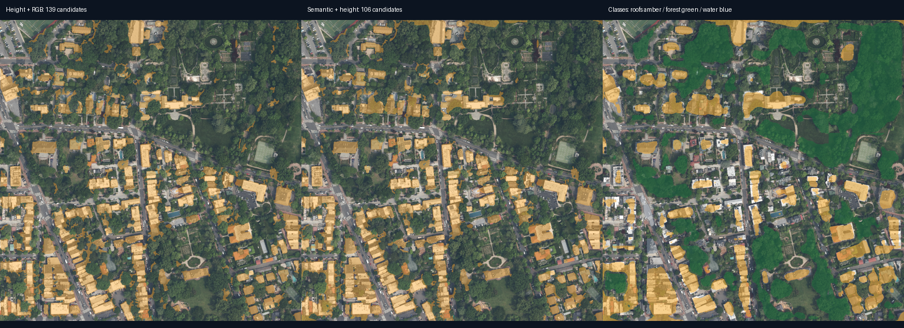
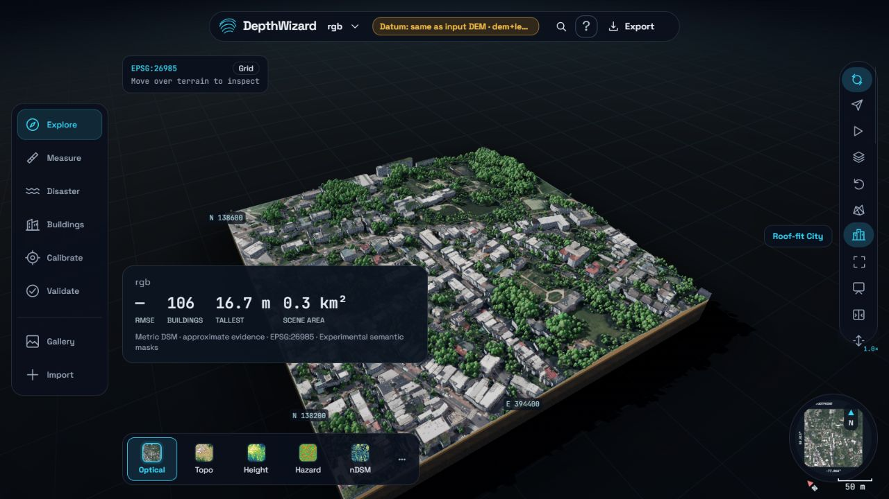

# Experimental building / canopy separation

Status: **opt-in research prototype**, 3 October 2026. No new training was run.
This stage classifies overhead RGB pixels before object extraction. It does not
correct building/tree heights or establish a new DSM accuracy benchmark.

## What changed

- Named SegFormer classes become building, tree/forest candidate, ground/low
  vegetation, water and road masks. Uncertain or unrecognised pixels keep the
  existing height + RGB detector.
- Confident tree, ground, water and road pixels are excluded from building
  candidates; confident building pixels bypass the green-colour rejection.
- City trees use the canopy candidates, including brown vegetation candidates.
  Forest labels describe woody vegetation, not individual trees or species.
- Labels are tiled with context halos and resampled with nearest neighbour.
  `semantic.tif` and viewer `semantic.bin` use canonical integer class codes.
- The normal pipeline enables this only for metric scenes finer than 2.5 m/px.
  Automatic height anchors are skipped during this experiment so changed
  building IDs cannot silently change the selected scale cues. Explicit anchors
  and the existing height/calibration pipeline retain their separate meanings.

## Checkpoint and reproducibility

Local checkpoint: `D:/DepthWizard/checkpoints/segformer-loveda-b2`.
Candidate: [wu-pr-gw/segformer-b2-finetuned-with-LoveDA](https://huggingface.co/wu-pr-gw/segformer-b2-finetuned-with-LoveDA),
pinned revision `5c74556c08bebb5f45f50b6f78f61a62c5d220c7`.
[LoveDA](https://github.com/Junjue-Wang/LoveDA) provides 0.3 m imagery from
Chinese urban/rural scenes; transfer to these scenes is not established.
The checkpoint publisher provides no model card, licence or training split.
Its training overlap is unknown. Keep this candidate experimental and resolve
licensing before redistribution or deployment. Weights are not committed.
Native Transformers classes load tensor weights with remote code disabled.

```powershell
$py = 'D:\DepthWizard\venv\Scripts\python.exe'
& $py scripts/prepare_semantic_model.py --out D:/DepthWizard/checkpoints/segformer-loveda-b2
& $py -m depthwizard samples/dc_lidar/glover_park/rgb.tif --out output/semantic-example --dem samples/dc_lidar/glover_park/dtm_2018_32m.tif --dem-kind terrain --no-fetch-dem --model D:/DepthWizard/checkpoints/da2-gamus-full --scene urban --semantic-model D:/DepthWizard/checkpoints/segformer-loveda-b2
```

Alternatively set `DEPTHWIZARD_SEMANTIC_CHECKPOINT` to the local checkpoint for
new server jobs. Leave it unset to retain the current default detector. A
configured checkpoint failure stops processing instead of fabricating masks.
The class softmax threshold is 0.6; this score is **not calibrated confidence**
and is not a height reliability score.

## Cached comparisons

All comparisons reused the same cached height grids for both detectors.
Neither the audit script nor semantic inference read reference height files.
Candidate counts measure extraction changes, **not correct-building counts**.

| Scene | Grid | Height + RGB candidates | Semantic + height candidates | Footprint area before / after |
|---|---|---:|---:|---:|
| Glover Park | 1024 × 1024 | 139 | 106 | 56,554 / 58,388 m² |
| Capitol Hill East | 1024 × 1024 | 75 | 71 | 129,609 / 134,539 m² |
| Quesenbank forest north | 512 × 512 display grid* | 20 | 16 | 1,568 / 1,168 m² |

*The forest job lacks a full-resolution DTM, so both detectors used the same
cached display DSM/DTM. This comparison is diagnostic only. The forest source
calibration also has the limitations described in the existing benchmarks.





Artifacts are in `data/jobs/semantic-prototype-glover`,
`data/jobs/semantic-prototype-capitol` and `data/jobs/semantic-prototype-forest`.
Each contains `comparison.json`, `comparison.png`, canonical labels and a
viewer scene. New footprints can merge or miss buildings; fewer candidates
alone do not prove better accuracy. Audit scenes omit stale building scores,
anchor IDs and analytics from the original scenes.

The full CLI smoke run (one depth pass, Glover RGB + 2018 terrain DEM, no height
reference) completed in 9.21 s on the local GPU and produced 108 candidates.
Its count differs from the cached comparison because the cached DSM used a
different checkpoint/ensemble. That is an integration check, not a comparison.

## Independent validation before enabling by default

No independent semantic reference dataset was downloaded for this task.
Use separate scene-disjoint labelled RGB tiles, with rooftops and woody canopy
labelled separately. Include leaf-off trees, green roofs, flat roofs, shadow,
water and tall objects. Record image date, GSD, label source/licence, split and
known training overlap. Never tune masks or thresholds on reserved height
references such as `samples/dc_lidar/*/lidar_dsm_2024.tif`.

Canonical reference PNG/TIFF codes: 0 unknown/ignore, 1 building, 2 woody canopy,
3 ground/low vegetation, 4 water, 5 road; 255 also means ignore. Labels must
share the exact RGB grid and orientation. A TIFF is read as a categorical image;
the script does not register or reproject reference labels automatically.

```powershell
& $py scripts/compare_semantic.py --scene-dir data/jobs/dc-glover-park --image samples/dc_lidar/glover_park/rgb.tif --model D:/DepthWizard/checkpoints/segformer-loveda-b2 --out data/jobs/semantic-audit-independent --reference-labels path/to/independent-class-labels.png
```

Outputs include per-class IoU, precision, recall, classified coverage, pixel
accuracy and the baseline building-mask score. Unknown predictions count as
misses rather than being removed from scoring. For height quality, score the
unchanged DSM separately and evaluate building attributes using independent
footprints; detection changes alone do not solve tall-object underestimation.
Choose settings on a development split, freeze them, then score a separate test
split. Enable a licensed model by default only after building/canopy recall and
false-positive checks demonstrate a benefit across those conditions.

## Verification

`pytest -q --disable-warnings`: **72 passed**, 164 warnings. JavaScript syntax
checks passed for `web/app.js` and `web/trees.js`. The Glover audit scene opened
in City view with the experimental label and no browser errors. Unit checks
cover categorical resampling, tile boundaries, unknown-pixel fallback, green
roof retention, canopy exclusion, unchanged height arrays and reference-mask
scoring. These are implementation checks, not validation of model accuracy.
